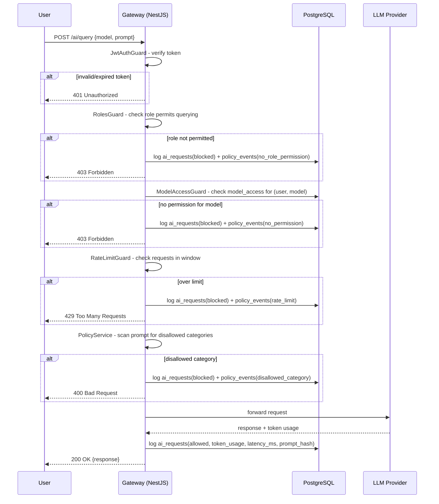

# LLM Access Control & Monitoring Gateway

A prototype gateway that sits between users and an LLM provider, enforcing role-based
permissions, rate limits, and content policy checks before a request reaches the model —
and recording an auditable trail of what happened after.

## The governance problem

When people or services call an LLM API directly, an organization loses several things at
once: it can't easily say who is allowed to use which model, it can't see usage patterns
until something goes wrong, it has no consistent way to block a category of request across
every caller, and if something *does* go wrong, there's no reliable record to investigate
from. Direct access effectively pushes access control, monitoring, and incident response
down to whatever each individual API key or integration happens to do — which in practice
means none of it happens consistently.

A gateway addresses this by becoming the *only* path to the model. Every request already
carries an authenticated identity, every permission check happens in one place, every
policy rule is enforced consistently regardless of which client is calling, and every
outcome — allowed or blocked — is logged the same way. This doesn't eliminate the need for
good judgment about what models should be used for; it just makes the org's actual policy
visible and enforceable instead of implicit.

## Architecture

```
User → NestJS API Gateway → Access/Policy Checks → LLM Provider API → Response → Audit Log / Dashboard
```

- **Backend**: NestJS + TypeORM + PostgreSQL
- **Auth**: JWT access tokens (short-lived) + rotating refresh tokens (hashed at rest)
- **Frontend**: React (Vite) monitoring dashboard
- **LLM access**: abstracted behind `LlmProviderService`, switchable between Anthropic,
  OpenAI, or a deterministic mock (default), so the pipeline can be exercised without a
  real API key
- **Deployment**: Docker Compose (Postgres, backend, frontend, and a Redis service
  used for multi-instance rate limiting)

### Roles

| Role | Can query permitted models | Can view audit logs | Can view dashboard | Can manage access |
|---|---|---|---|---|
| Researcher | ✅ | own logs only, via `/audit/logs` if also granted Reviewer | ❌ | ❌ |
| Reviewer | ✅ | own logs only | ❌ | ❌ |
| Admin | ✅ | all logs | ✅ | ✅ |

### `/ai/query` request sequence



This sequence is implemented as an ordered NestJS guard chain
(`JwtAuthGuard` → `RolesGuard` → `ModelAccessGuard` → `RateLimitGuard`), followed by
`AiService.query()`, which performs the policy content check and the LLM call. Each guard
that blocks a request writes its own `ai_requests` + `policy_events` rows before rejecting,
so blocked attempts are just as visible in the audit trail as successful ones.

### Database schema

```
users             (id, email, password_hash, role, is_active, created_at)
refresh_tokens    (id, user_id, token_hash, expires_at, revoked, created_at)
model_access      (id, user_id, model, permission, granted_by, granted_at)
ai_requests       (id, user_id, model, prompt_hash, prompt_excerpt, timestamp, status, token_usage, latency_ms)
policy_events     (id, request_id, user_id, rule_triggered, action, created_at)
```

### Privacy trade-off: hashing prompts instead of storing them

`ai_requests` never stores the full raw prompt. It stores a keyed HMAC `prompt_hash` and no
prompt excerpt. This is a deliberate
trade-off:

- **What it buys you**: an admin investigating abuse can compare hashes to spot the same
  prompt being sent repeatedly (e.g. an automated script hammering the gateway), without the
  gateway becoming a repository of everyone's full conversation history. Reduces the blast
  radius if the database is ever compromised or subpoenaed.
- **What it costs you**: an admin cannot read the actual content of a flagged or blocked
  request to understand *why* it was risky, beyond the rule that matched and the short
  excerpt (when the prompt wasn't flagged). Root-causing a subtle policy failure — e.g. a
  request that *should* have been blocked but wasn't — is harder without the original text.

A production system would likely make this configurable per-organization (e.g. full-prompt
retention with a stricter access-control and retention policy, only for Admins investigating
an active incident) rather than a single fixed choice. This prototype picks the more
privacy-preserving default.

## Threat model

This is a prototype, not a hardened system, but it's worth being explicit about what it
does and doesn't defend against.

**Stolen or leaked JWT / credentials.** Access tokens are short-lived (15 min default), so
a stolen access token has a small window. Refresh tokens are stored hashed, are rotated on
every use (the old one is revoked as soon as a new pair is issued), and a deactivated user's
tokens stop working on the next request via a live `isActive` check in the JWT strategy —
not just at next expiry. Passwords are hashed with argon2. **Gap**: this prototype doesn't
implement device binding, IP anomaly detection, or automatic revocation of *all* a user's
sessions on suspected compromise — an admin would need to manually deactivate the account.

**Privilege escalation.** Every route requires an explicit `@Roles(...)` declaration;
`RolesGuard` throws if a route has none, so a new endpoint added without a role policy fails
closed rather than open. Model access is checked per-user, per-model, independent of role —
a Researcher's role does not grant any model access by itself. **Gap**: there's no
protection here against a compromised Admin account, which by design can grant itself or
others anything (see "Administrator misuse" below).

**Excessive/automated API usage.** `RateLimitGuard` enforces a per-user request budget per
time window; requests over the limit are rejected before ever reaching the LLM provider (and
before any token cost is incurred) and are logged as a `rate_limit` policy event. **Gap**:
when `REDIS_URL` is configured, counters use atomic Redis operations and are shared across
gateway instances.

**Sensitive prompt content ending up in logs.** Raw prompts are never persisted to the
database (see privacy trade-off above), and the `LoggingInterceptor` explicitly logs only
method/route/user/status/latency — never request bodies. **Gap**: the LLM provider itself
(Anthropic/OpenAI) still receives the full prompt and is subject to its own data-handling
policies, which this gateway doesn't control.

**Bypassing the gateway.** The gateway is designed to be the only component holding LLM
provider API keys — they live only in backend environment variables, never sent to or
readable by the frontend. As long as that's true organizationally (i.e., no one hands out
provider API keys directly), there's no other path to the model. **Gap**: this is a policy
assumption, not something the code can enforce — if someone with server access exports the
`ANTHROPIC_API_KEY` and calls the provider directly, no part of this system would know.

**Administrator misuse.** Admins can grant themselves or anyone else access to any model,
view all audit logs, and deactivate any user. `admin.controller.ts` requires the `Admin`
role on every route, so at least these actions can't be reached by other roles.
**Gap**: admin actions (granting access, changing a role, deactivating a user) are not
currently written to a separate, tamper-evident admin-action log — an Admin who over-grants
access or improperly reads logs leaves the same trail as any legitimate change. A production
version should log admin actions to an append-only table that even Admins can't edit, and
ideally require a second Admin's approval for sensitive changes (four-eyes principle).

## What is NOT production-ready yet

- No secrets manager (Vault, AWS Secrets Manager, etc.) — secrets are plain environment
  variables, fine for local/prototype use, not for a real deployment.
- No mTLS or network-level isolation between the backend, database, and Redis — everything
  currently trusts the Docker network boundary.
- Redis is required for consistent rate limiting across multiple backend instances.
- Database schema changes use a tracked initial TypeORM migration. Existing databases
  created by the former synchronize-based startup are safely baselined by that migration;
  future schema changes should be added as new migrations.
- The policy content filter is a naive keyword list (`POLICY_BLOCKED_CATEGORIES`), included
  to demonstrate *where* a policy check belongs in the pipeline — a real deployment should
  call a proper moderation/classification service here.
- No admin-action audit log (see "Administrator misuse" gap above).
- Frontend keeps access tokens in memory and persists only the rotating refresh token, so a
  page refresh can restore the session and expired access tokens are renewed automatically.
  A production deployment should move the refresh token to an HttpOnly, Secure, SameSite
  cookie to reduce exposure to script-based token theft.

## Setup

### 1. Configure environment

```bash
cp .env.example .env
# edit .env - at minimum, set real values for JWT_ACCESS_SECRET and JWT_REFRESH_SECRET
```

### 2. Start everything

```bash
docker-compose up --build
```

This brings up Postgres, the NestJS API (port 3000), and the React dashboard (port 5173).

### 3. Seed initial users

```bash
docker-compose exec backend npm run seed
```

This creates one user per role and a couple of model access grants. Supply unique credentials
through `SEED_ADMIN_EMAIL`, `SEED_ADMIN_PASSWORD`, `SEED_REVIEWER_EMAIL`,
`SEED_REVIEWER_PASSWORD`, `SEED_RESEARCHER_EMAIL`, and `SEED_RESEARCHER_PASSWORD`.
The seed command refuses to run in production.

| Role | Email | Password |
|---|---|---|
| Admin | `SEED_ADMIN_EMAIL` | `SEED_ADMIN_PASSWORD` |
| Reviewer | `SEED_REVIEWER_EMAIL` | `SEED_REVIEWER_PASSWORD` |
| Researcher | `SEED_RESEARCHER_EMAIL` | `SEED_RESEARCHER_PASSWORD` |


### 4. Log in

Open `http://localhost:5173`, sign in as `admin@example.com` to see the full monitoring
dashboard, or as `researcher@example.com` / `reviewer@example.com` to see the
role-appropriate scoped view.

### Running the backend locally without Docker

```bash
cd backend
npm install
cp .env.example .env   # point DB_HOST at your local Postgres
npm run start:dev
npm run seed
```

### Running tests

```bash
cd backend
npm test
```

Covers the guard chain (`RolesGuard`, `ModelAccessGuard`) and the policy filter
(`PolicyService`) — the security-critical logic that decides whether a request reaches the
model at all.

## Project structure

```
llm-gateway/
  backend/            NestJS API gateway (see backend/src for module layout)
  frontend/           React monitoring dashboard
  docker-compose.yml  Orchestrates postgres, redis, backend, frontend
  .env.example        Root-level compose environment template
```
